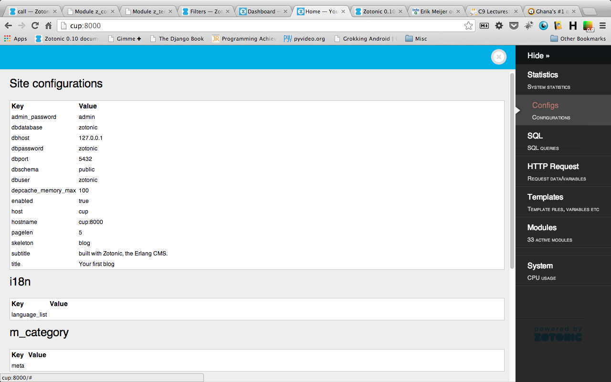
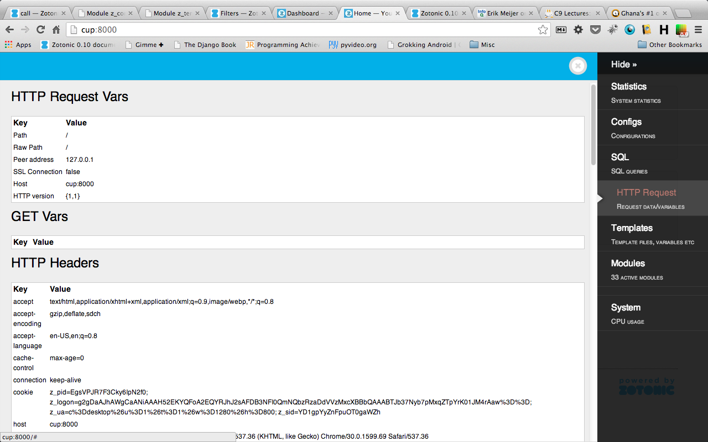
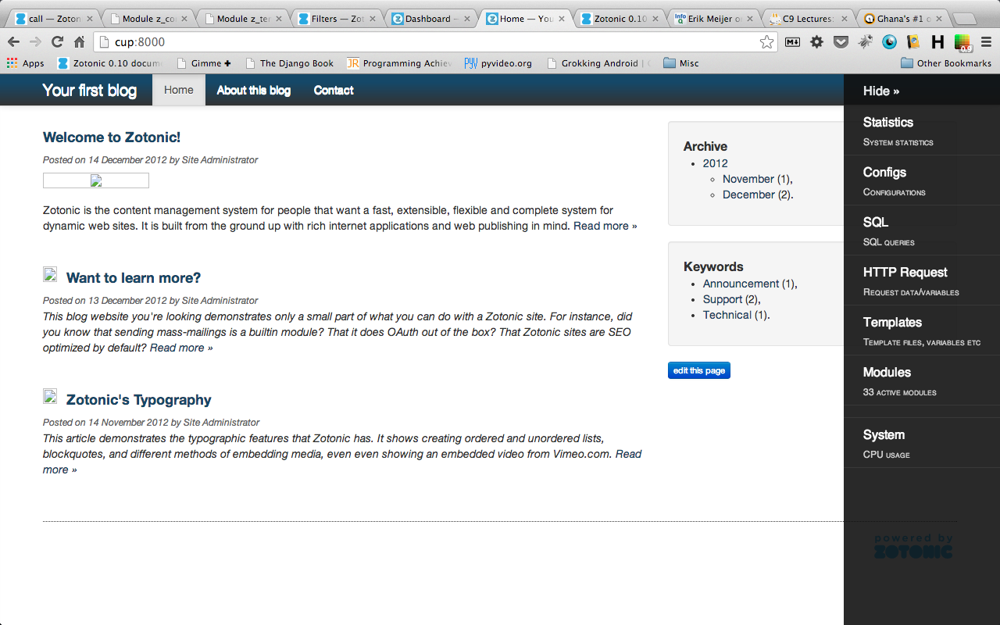

# Zotonic Debug Toolbar - ZDT
Debugging toolbar for Zotonic implemented as a module.

Shamelessly ripped off from the Django Debug Toolbar :-)

Basically, what it does is to add a diagnostics toolbar to Zotonic applications.
When enabled, it injects an html div to the right side of the web application
with easy access to logging, database queries, request variables, session/cookie data,
application modules, Erlang runtime info, and other useful information.

## Overview of the toolbar

- Modules: path, status, dependencies
- Request vars [GET, POST, session, cookies, http headers]
- Settings - site configs
- Message logs
- Template context variables
- Resource usage
- Sql profiler
- Process Info:
- URL dispatch

## How to use
Insert `` in a template file, preferably the base template file(`base.tpl`).

A better approach will be add a debug key to the site config: `{debug, true}`, and then add the following to `base.tpl`:

    
        
    

## Configs

The following configs keys can be set via the Zotonic site dashboard's
configuration page. The module should be, mod_zdt and the key, value
pairs as follows:

* address: Peer addresses to display the debug toolbar to.

  Example: 127.0.0.1, ::1, localhost, 23.45.87.7

  Use "*" to enable all access

* panels: Panels to display

  Example: message_log, system, modules. sql

  Panels names: stats, configs, dispatch, sql, http_vars, templates, modules, logs, system
  To enable all, leave the panels config blank or set "*"

OR in your Erlang shell: m_config:set(mod_zdt, address, "78.23.455.1, 23.45.87.7", Ctx).

## Screenshots

## Panels under construction

- SQL profiler: displays the queries made by the current request, and profile them by execution time.
- Events [observers and notifications]

## TODO
See the TODO file

## Credits

Credit goes to the Django Debug Toolbar authors, especially for the
frontend component of this module.

## Contributing

Issues, forks, and pull requests are welcome!
